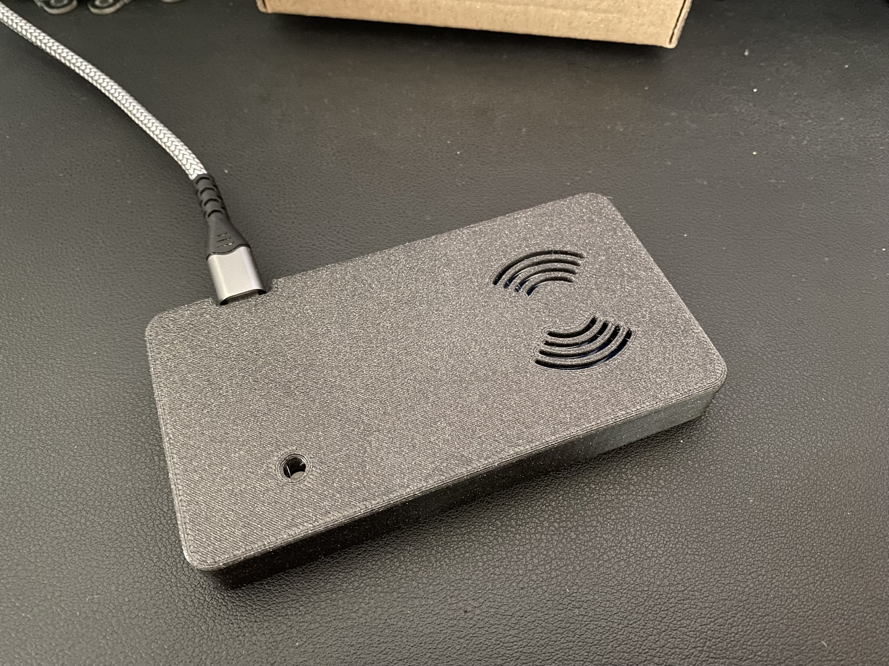
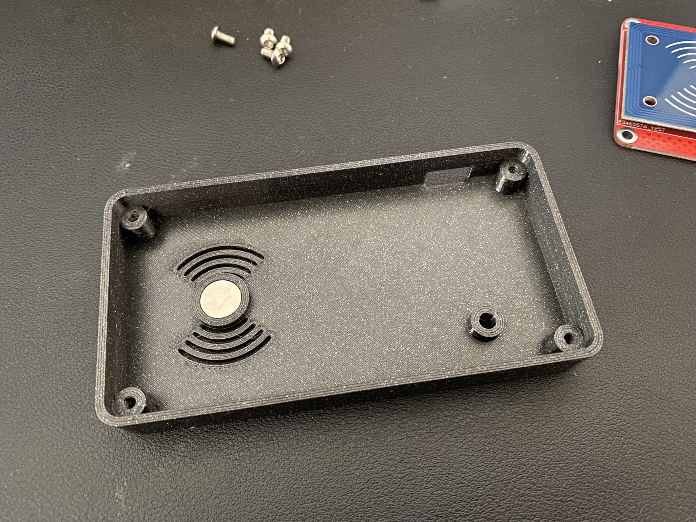
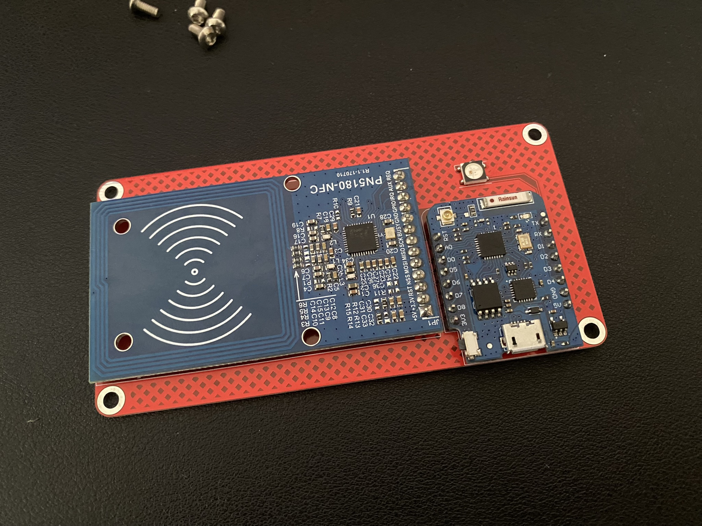

# PN5180_Wemos_PCB

[![CC BY-NC-SA 4.0][cc-by-nc-sa-shield]][cc-by-nc-sa]

This work is licensed under a
[Creative Commons Attribution-NonCommercial-ShareAlike 4.0 International License][cc-by-nc-sa].

[![CC BY-NC-SA 4.0][cc-by-nc-sa-image]][cc-by-nc-sa]

[cc-by-nc-sa]: http://creativecommons.org/licenses/by-nc-sa/4.0/
[cc-by-nc-sa-image]: https://licensebuttons.net/l/by-nc-sa/4.0/88x31.png
[cc-by-nc-sa-shield]: https://img.shields.io/badge/License-CC%20BY--NC--SA%204.0-lightgrey.svg

## Donations / Spenden
If somebody wants to support me for upcoming projects :)  
- PayPal:  
- Amazon Giftcard: https://www.amazon.de/Amazon-Gutschein-per-E-Mail-Amazon/dp/B0054PDOV8 - stefan.riese@me.com

# PN5180 ESP reader
This reader uses a PN5180 RFID reader and a Wemos D1 mini to read RFID tags like ISO 15693.

